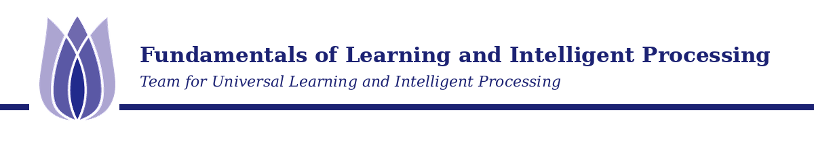

[](https://github.com/tulip-lab/pattern-classification-lab/issues) [](https://github.com/tulip-lab/pattern-classification-lab/pulls) [](https://github.com/tulip-lab/pattern-classification-lab/stargazers/)

---



# FLIP: Pattern Classification Lab

**FLIP** stands for **Fundamentals of Learning and Intelligent Processing**.

This is the practical site for [FLIP: Pattern Classification](https://github.com/tulip-lab/pattern-classification). It provides runnable notebooks, public data, implementation exercises, and practical guidance. Use the linked course portal for module concepts, lecture materials, recommended textbooks, offering information, and other authoritative course links.

The practical sequence develops inspectable workflows for Bayesian decisions, estimation, probabilistic and nonparametric models, stochastic methods, discriminants, model evaluation, large language models, agentic AI, and privacy.

---

- Follow the stable `M01–M11` module sequence used across the course.
- Use public course documents, approved open data, or small synthetic examples.
- Report issues through this repository's [issue tracker](https://github.com/tulip-lab/pattern-classification-lab/issues).
- Pull requests that improve clarity, reproducibility, accessibility, or safety are welcome.
- Point of contact: [Prof. Gang Li](https://github.com/tuliplab).

Prepared by :tulip: **[TULIP Lab](https://www.tulip.academy), Australia**

---

## Start here

- Use the [module table below](#modules) as the canonical student navigation for lab-session materials.
- Read the [data policy](Data/README.md) and [licensing guidance](LICENSING.md) before adding data or third-party material.
- Use the [issue tracker](https://github.com/tulip-lab/pattern-classification-lab/issues) and [contribution guide](CONTRIBUTING.md) for corrections and lab improvements.

## Unit materials

The module table is the single student-facing index of practical materials. For curriculum design and contribution work, the [curriculum alignment and coverage map](PRACTICAL-MAP.md) records how each practical connects to the common core, what evidence learners retain, and which gaps remain. Instructor-only solutions, hidden data, private evaluators, moderation records, and teaching notes are maintained separately.

### How to work through the labs

Follow the modules in order unless your instructor provides a different path. Within each notebook:

1. read the purpose, prerequisites, and expected output;
2. run the supplied baseline before changing it;
3. inspect intermediate data, parameters, predictions, and diagnostics;
4. test normal, edge or missing-information, and failure behaviour;
5. compare alternatives using appropriate evidence; and
6. restart and run from the top, then record limitations and conclusions.

The core practical path uses synthetic data or datasets bundled with standard Python packages and does not require a paid service or credential.

## Data and documents for labs

Use the following source order:

1. public materials in this repository and the common-core repository;
2. public datasets from [TULIP Lab Open Data](https://github.com/tulip-lab/open-data);
3. small synthetic examples created inside the notebook; and
4. external public data only when the learning objective requires it.

See the [data policy](Data/README.md) for provenance, licensing, privacy, and repository-size requirements.

## Recommended platforms

- [Google Colab](https://colab.research.google.com) for notebook practicals;
- [JupyterLab](https://jupyter.org) for local notebook work;
- [GitHub](https://github.com) for versioned public course materials; and
- local Python environments for clean reruns and reproducibility checks.

## Modules

| Module | Category | Topic | Module materials |
| :---: | :---: | --- | --- |
| :one: | Orientation | Induction | [M01 study guide](M01-Induction/README.md) |
| :two: | Foundation | Mathematical Foundations | [M02A classification workflow and features](M02-Foundations/M02A-Classification-Workflow-and-Features.ipynb) |
| :three: | Core | Bayesian Decision Theory | [M03A Bayesian decisions and boundaries](M03-Decision-Theory/M03A-Bayesian-Decision-and-Boundaries.ipynb) |
| :four: | Core | Parameter Estimation | [M04A MLE, MAP, and EM](M04-Parameter-Estimation/M04A-Parameter-Estimation-MLE-MAP-EM.ipynb) |
| :five: | Core | Parametric Models | [M05A HMM and Naive Bayes](M05-Parametric-Models/M05A-Probabilistic-Models-HMM-and-Naive-Bayes.ipynb) |
| :six: | Core | Nonparametric Methods | [M06A Parzen windows and KNN](M06-Nonparametric-Methods/M06A-Nonparametric-Classification-Parzen-and-KNN.ipynb) |
| :seven: | Advanced | Stochastic Methods | [M07A simulation to decision](M07-Stochastic-Methods/M07A-Stochastic-Methods-from-Simulation-to-Decision.ipynb) |
| :eight: | Core | Discriminant Functions | [M08A optimisation and SVM](M08-Discriminant-Functions/M08A-Discriminant-Functions-Optimisation-and-SVM.ipynb) |
| :nine: | Core | Model Evaluation | [M09A model selection and generalisation](M09-Model-Evaluation/M09A-Model-Selection-and-Generalisation.ipynb) |
| M10 | Advanced | Large Language Models and Agentic AI | [M10 practical guide and selected Agentic AI labs](M10-LLM-Agentic-AI/README.md) |
| M11 | Advanced | Privacy | [M11 differential privacy practical guide](M11-Privacy/README.md) |

## Software and environment requirements

Most notebooks run in Google Colab. For local setup:

```bash
python -m venv .venv
source .venv/bin/activate       # Windows: .venv\Scripts\activate
python -m pip install -r requirements.txt
jupyter lab
```

Students do not need to install every optional package at the start of the course. Individual notebooks identify any additional dependency.

## Public repository safety

Do not commit credentials, `.env` files, student submissions, grades, identifiable feedback, unpublished solutions, private datasets, hidden evaluation data, large model weights, generated caches, or instructor-only material.

## Contributing through pull requests

Lab-session corrections and improvements belong in this repository. Keep each change focused, preserve the stable module and session identifier, rerun every changed notebook from top to bottom, and explain the learning impact and checks performed in the pull request. See [CONTRIBUTING.md](CONTRIBUTING.md) for the workflow and review expectations.

Do not submit assessed work through a public pull request unless an assignment brief explicitly requires that method. Follow the private submission route in your current offering.

## Licensing

Teaching content and code use separate licences. See [LICENSING.md](LICENSING.md) and [NOTICE.md](NOTICE.md) for scope, attribution, and exclusions.

## Contributors

Thanks goes to these wonderful people :tulip:

<a href="https://github.com/tulip-lab/pattern-classification-lab/graphs/contributors">
  
</a>

Made with [contributors-img](https://contrib.rocks).
